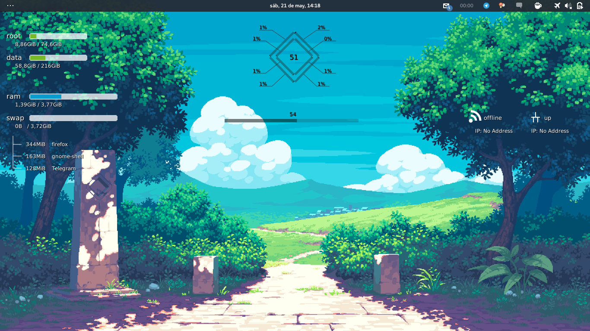

# conky config (Evo HUD)

My conky configuration file:

## Resources

This configuration uses [conky-draw](https://github.com/fisadev/conky-draw) for
bargraphs and rings, as well as Viga font.

## Usage

Place the directory somewhere and run:

~~~shell
$ conky -c <path to evo_hud>
~~~
